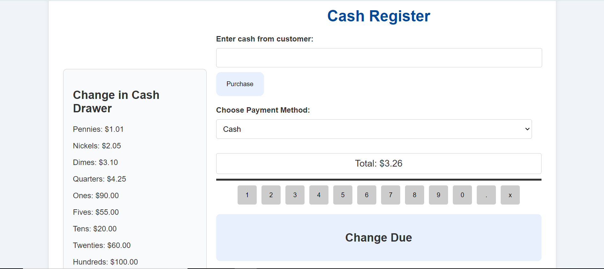

# Build-a-Cash-Register

Here's a README file template for your Cash Register project:

## Features

The Cash Register is a web application that calculates change and updates the cash drawer based on the amount provided by the customer. It provides the following features:

* Input field to enter the amount of cash received from the customer
* Dropdown menu to select the payment method
* Button to process the purchase and calculate change
* Displays the change due and the updated state of the cash drawer
* Button to print a receipt with transaction details


## Live Demo


You can view the project [here](https://zohalmirkhel.github.io/Build-a-Cash-Register/)


## Installation

To set up this project locally, follow these steps:


1. **Clone the repository**:
   ```bash
   git clone git@github.com:ZohalMirkhel/Build-a-Cash-Register.git
   ```
2. **Navigate to the project directory**:
   ```bash
   cd register
   ```

3. **Open the `index.html` file in your browser**:
   ```bash
   open index.html
   ```

4. **View the source code:**
If you want to explore the source code, open the project in your preferred code editor (e.g., VSCode):
   ```bash
   code .
   ```


## Technologies Used

* HTML
* CSS
* JavaScript

Note: No additional installations or dependencies are required for the JavaScript to work properly. The code runs directly in the browser.


## Contributing

We welcome contributions to improve the Roman Number Converter. If you have ideas for enhancements, notice any issues, or want to work on this project, please follow these steps:

1. **Fork the repository**.
2. **Create a new branch:** `git checkout -b feature-name`
3. **Make your changes and commit them:** `git commit -m "Description of changes"`
4. **Push to the branch:** `git push origin feature-name`
5. **Create a pull request**


## Troubleshooting

If you encounter any issues with the application, please refer to the following:

* Check that you have entered a valid Arabic number in the input field.
* Ensure that you have enabled JavaScript in your browser.
* If you are still experiencing issues, feel free to open an issue on this repository or contact me directly.

## Author

For any questions, feedback, or support, please contact me at:
- Email: [zohalmirkhel@gmail.com](mailto:zohalmirkhel@gmail.com)
- GitHub: [Zohal Mirkhel](https://github.com/ZohalMirkhel)